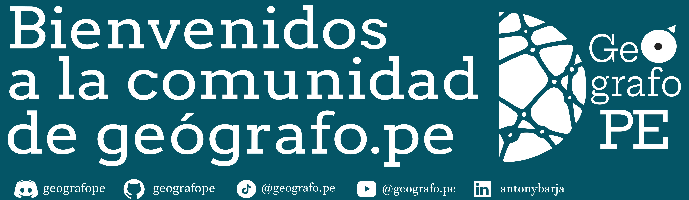

📂 Este repositorio reúne una colección de ideas, debates 💭, y sugerencias 💡 mediante la sección de [discussion](https://github.com/geografope/ideas-tutorial/discussions) que han sido recomendadas y abiertas por la comunidad 🌐. Su propósito de este repositorio es inspirar y facilitar la creación de contenido creativo 🎥✨ para YouTube y otras redes sociales 📱📸. ¡Explora y comparte tu visión para dar vida a grandes proyectos y nuevo contenido! 🚀🎬
